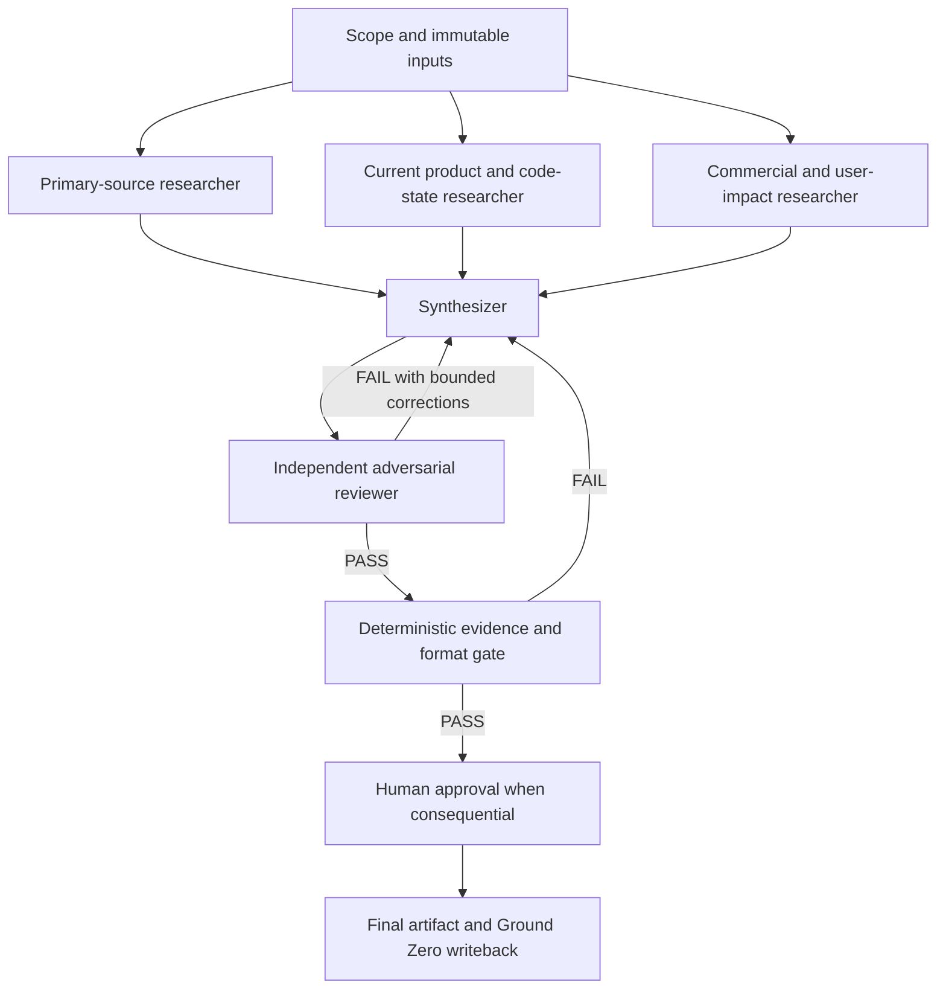

# Graph engineering research and implementation playbook

## Bottom line

Graph engineering is not a new prompting technique. It is a new label for designing the execution topology around several AI agents, deterministic steps, tools and human checkpoints. A node does work, an edge decides what may happen next, and typed shared state carries evidence and decisions between them. A single autonomous loop is simply the smallest cyclic graph.

The mechanics are old. State machines, workflow engines, LangGraph, AutoGen, Google ADK and multi-agent orchestration already used them. What is new in July 2026 is the vocabulary and the fact that coding agents are now capable enough to sit inside nodes as substantial workers rather than single model calls.[6][8]

For Sam, the useful interpretation is simple: **stop trying to make one agent research, build, review, approve and report inside one conversation when those roles need different permissions, evidence or failure rules. Make the handoffs explicit.**

## What Peter Steinberger actually said

At 00:34 UTC on 18 July 2026, Peter Steinberger posted: “Are we still talking loops or did we shift to graphs yet?”[1][7] He did not announce a framework, define the term or claim to have invented it.

The wording existed earlier. Itamar Friedman described a shift from prompt engineering to “flow (/graph) engineering” in February 2024.[2] On 11 July 2026, Mike (@michaelmasson55) posted the now-familiar progression: prompt, context, harness, loop, then graph engineering.[3]

Steinberger amplified the label. Shubham Saboo replied that loops make agent behaviour programmable while graphs make agent organisations programmable.[4] Harrison Chase then gave the blunt skeptical read: “it’s basically just langgraph?”[5] LangChain’s formal response agreed with the substance: graph-shaped agent systems are useful, but they had already been building them for three years.[6]

## The five layers

1. **Prompt engineering:** What instruction should this model receive?
2. **Context engineering:** What evidence, memory and constraints should it see?
3. **Harness engineering:** What tools, filesystem, permissions and recovery mechanisms surround it?
4. **Loop engineering:** How does one agent plan, act, verify, retry and stop?
5. **Graph engineering:** Which agents and deterministic steps exist, how may work move between them, what state is shared, and where is human authority required?[3][8]

These layers compose. A graph does not repair weak prompts, missing evidence or an agent loop with no reliable verifier. It multiplies those defects.

## Execution graph, not knowledge graph

This term is easily confused with Ground Zero’s Obsidian graph or GraphRAG.

- A **knowledge graph** structures what the system knows, such as people, companies, homes, documents and relationships.
- An **execution graph** structures how work runs, such as researcher to writer to reviewer to approval.

Ground Zero is primarily shared knowledge and durable state. Hermes Kanban, specialist profiles, scripts and approval gates can form the execution graph around it.[8][9]

## Core primitives

### Nodes

A node should represent a real boundary:

- a specialist agent with different instructions, model or tools
- deterministic code or a test suite
- a router or join
- a database or API lookup
- an independent evaluator
- a human approval checkpoint

A sequence of prompt paragraphs is not automatically a set of nodes.

### Edges

Edges are permitted transitions:

- sequential: research then synthesis
- conditional: PASS to finalise, FAIL to revise
- fan-out: run independent checks in parallel
- fan-in: combine several results with a defined reducer
- interrupt: stop for human input or approval
- terminal: done, rejected, expired or blocked

### Shared state

State must be typed and ownership must be explicit. A useful run state includes:

```yaml
run_id:
objective:
immutable_inputs: []
source_evidence: []
assumptions: []
node_outputs: {}
review_findings: []
quality_scores: {}
budget_used:
retries:
approval_status:
side_effect_receipts: []
terminal_status:
```

Each node reads only what it needs and writes only fields it owns. Parallel writes require a reducer, such as append, merge, highest-confidence result, or explicit conflict escalation.

### Gates and checkpoints

Hard rules belong in routing code, policy checks or task dependencies, not only inside prompts. Persist state before human interrupts and consequential actions. Any side effect before a retry or interrupt must be idempotent.[6][9]

## When a graph earns its keep

Use a graph when at least one of these is real:

- distinct specialties must hand off
- independent work can fan out and later join
- reviewers need different models, tools or read-only permissions
- the workflow needs explicit branching or approval
- one failure should retry without corrupting the whole run
- long-running work needs checkpoint and resume
- an audit must show who did what, using which evidence

Stay with one loop when the task has one objective, one toolset and one clear verifier. “Summarise this document” does not need five agents. A recurring sourced briefing with parallel research, independent review and a publication gate probably does.[6][8]

## The graph we should implement first

The first pilot should be an internal, read-only evidence workflow. Do not start by adding a graph framework to OpenHouse production.



### Mapping to the tools already in place

- **Nodes:** Hermes specialist profiles, Kanban tasks, scripts, test suites and Sam approval.
- **Edges:** Kanban parent dependencies and conditional task creation after PASS or FAIL.
- **Fan-out:** several child tasks sharing the same parent.
- **Fan-in:** one synthesizer task whose parents are all research tasks.
- **State:** structured Kanban handoffs plus a versioned run manifest in Ground Zero.
- **Checkpoint:** Kanban run history and git commits.
- **Interrupt:** a blocked task requiring Sam’s decision.
- **Terminal states:** done, blocked, rejected or cancelled.
- **Approval boundary:** no publish, production change, outreach, payment or customer communication without Sam.

Hermes already contains most of the runtime. The missing piece is a reusable graph contract and evaluation harness, not another large framework.

## Three practical uses

### 1. OpenHouse evidence-backed answer and release review

Best first commercial use after the internal pilot:

```text
request
→ authenticate and resolve exact home
→ fan out to approved home record, document evidence and operational state
→ join with provenance and conflict handling
→ generate bounded answer or artifact
→ independent grounding and authority review
→ route to answer, clarification, escalation or human approval
→ write a receipt
```

Why it fits: OpenHouse already depends on exact-home authority, claim-level evidence, guardrails, independent review and fail-closed release gates. The graph makes those boundaries visible and testable. It should wrap existing guardrails, never replace them.

### 2. Ground Zero research and decision briefs

Use the pilot graph for funding research, technical audits and strategic briefs. Ground Zero becomes the durable state and evidence store, while the execution graph produces one reviewed artifact. This directly reduces the risk of a single agent both creating and approving its own conclusion.

### 3. OpenBook

Do not graph OpenBook’s client portal or Stripe billing yet. Those are deterministic product workflows and ordinary code is clearer. A graph becomes useful later for fact-safe prospect preview production, where research, asset generation, claim review, preview creation and Sam approval are distinct roles.

## Node contract

Every node should declare:

```yaml
id:
purpose:
required_inputs:
allowed_tools:
allowed_state_reads:
allowed_state_writes:
output_schema:
timeout:
max_retries:
retryable_failures:
non_retryable_failures:
side_effects:
idempotency_key:
budget:
verifier:
on_pass:
on_fail:
owner:
```

A node that accepts the whole state and returns unstructured prose is not engineered enough to trust.

## Rules for reliable graphs

1. **Draw the graph before coding.** If the happy path and one failure loop do not fit on one screen, shrink it.
2. **Keep routing deterministic where rules are known.** Use a model to classify only when semantic judgement is genuinely needed.
3. **Use agents inside nodes, not everywhere.** Authentication, permissions, joins, budgets and release gates should stay deterministic.
4. **Give the evaluator teeth.** It should return structured PASS or FAIL with exact criteria and must not silently fix the worker’s output.
5. **Bound cycles.** Set retry count, token budget, time budget and a terminal escalation route.
6. **Isolate tools and identity.** A reviewer should not inherit production-write tools merely because the worker has them.
7. **Version the topology and contracts.** A graph change is a system change.
8. **Trace every run.** Record graph ID, version, run ID, node ID, model, tool calls, latency, cost, decision and side-effect receipt.[9]
9. **Evaluate the whole graph.** Node quality is necessary but not sufficient. Measure routing accuracy, join correctness, failure recovery and final task success.
10. **Collapse unnecessary nodes.** Complexity must earn itself.

## Framework choice

#
## Notes that link here
_Auto-generated: updated by wiki-refiner_
- [[context/index]]
- [[context/ops-automation-moc]]
- [[items/ops-graph-engineering-pilot]]

## Recommendation: use Hermes Kanban and small scripts first

This fits the existing operating system, preserves Sam’s approval boundaries and avoids adding a second orchestrator. Prove the graph on three real internal runs before introducing a runtime library.

### Use LangGraph when

- the graph belongs inside a long-running application
- durable checkpoint and resume are required
- dynamic fan-out and fan-in happen at runtime
- Python is acceptable
- the workflow needs explicit interrupts and state-machine semantics

LangGraph’s own account emphasises the useful balance between deterministic code and agentic nodes. It also warns that production graphs are often cyclic, not simple DAGs, and that dynamic transitions matter.[6]

### Other valid options

- **Google ADK:** strongest fit for a GCP-native system or cross-framework A2A interoperability.
- **Microsoft Agent Framework:** strongest fit for a Microsoft and .NET estate.
- **CrewAI:** fast role-based prototype, less attractive for exact control and durable state.
- **LlamaIndex Workflows:** useful for document-heavy, event-driven retrieval pipelines.
- **OpenAI Agents SDK:** lighter handoffs for an OpenAI-only chain, but not the strongest full graph runtime.[10]

## Three-run pilot

Run the proposed internal graph on three tasks that have known evidence and an independent final check:

1. one current AI research brief
2. one OpenHouse release-readiness or evidence audit
3. one commercial meeting-preparation brief

Capture for each run:

- final PASS or FAIL
- human corrections after automated PASS
- unsupported claims caught
- routing errors
- retries and reason
- wall-clock time
- model and tool cost
- comparison against a single-agent baseline
- whether any node could be removed without quality loss

Adopt the pattern only if it reduces material human corrections or failure risk enough to justify the extra calls and latency.

## Honest conclusion

“Graph engineering” is partly a naming event and partly a useful maturity signal. It is not a magic successor to prompting. The valuable move is making coordination, state, verification and authority explicit once one agent loop is no longer the right shape.

For Sam’s current system, the implementation path is not “install LangGraph everywhere.” It is:

1. define one internal evidence graph
2. run it through existing Hermes Kanban primitives
3. measure it against a single-agent baseline
4. retain only the nodes that create verified value
5. move a graph into OpenHouse only when a product workflow genuinely needs durable branching, auditability and human checkpoints

## Connected vault notes

- [[context/agentic-value-creation-mission]]
- [[context/founder-execution-os]]
- [[context/ops-automation-moc]]
- [[context/llm-wiki-pattern]]
- [[items/ops-graph-engineering-pilot]]
- [[companies/openhouse-ai]]
- [[companies/openbook]]
- [[project_state/oh]]

## Sources

[1] https://x.com/steipete/status/2078277297791189132 - Peter Steinberger: loops or graphs
[2] https://x.com/itamar_mar/status/1763168555539812407 - Itamar Friedman: flow/graph engineering
[3] https://x.com/michaelmasson55/status/2075913998449701170 - Mike: five-layer engineering ladder
[4] https://x.com/Saboo_Shubham_/status/2078301249376825397 - Shubham Saboo: programmable agent orgs
[5] https://x.com/hwchase17/status/2079219804951683380 - Harrison Chase: basically LangGraph?
[6] https://www.langchain.com/blog/3-years-of-graph-engineering-with-langgraph - LangChain: 3 Years of Graph Engineering with LangGraph
[7] https://www.aibuilderclub.com/blog/graph-engineering-peter-steinberger - AI Builder Club: Peter Steinberger's Loops or Graphs Tweet
[8] https://www.aibuilderclub.com/blog/graph-engineering-guide-2026 - AI Builder Club: Graph Engineering Guide 2026
[9] https://www.truefoundry.com/blog/graph-engineering-enterprise-guide - TrueFoundry: Graph Engineering Enterprise Guide
[10] https://datasciencedojo.com/blog/graph-engineering-frameworks - Data Science Dojo: Frameworks Doing Graph Engineering
